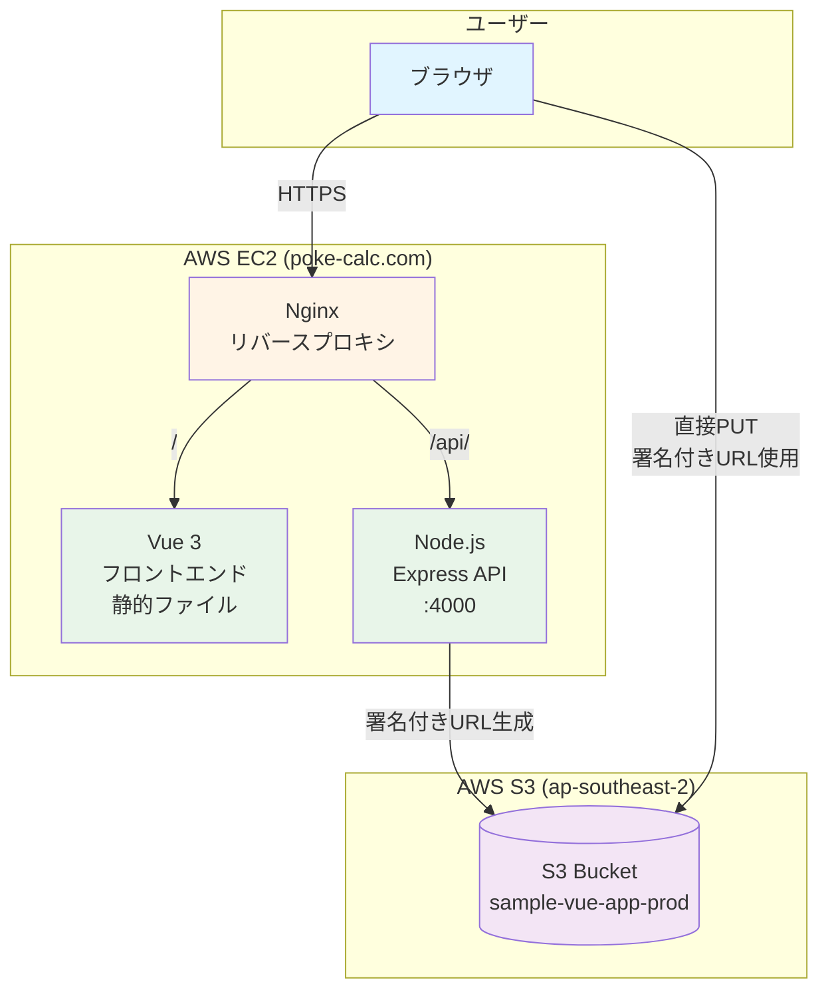
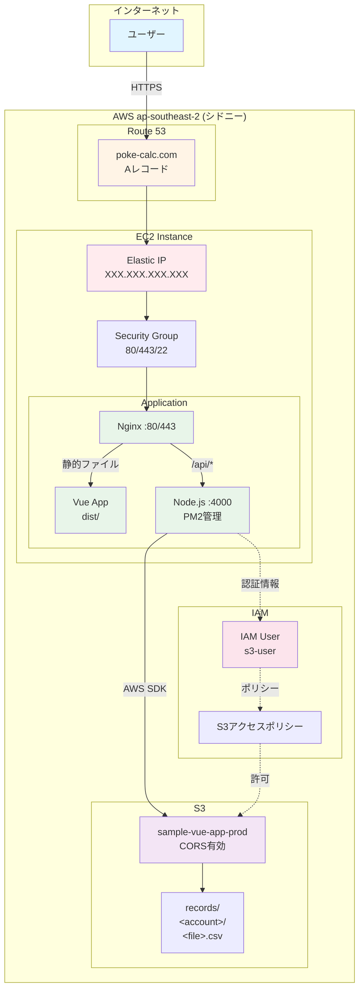
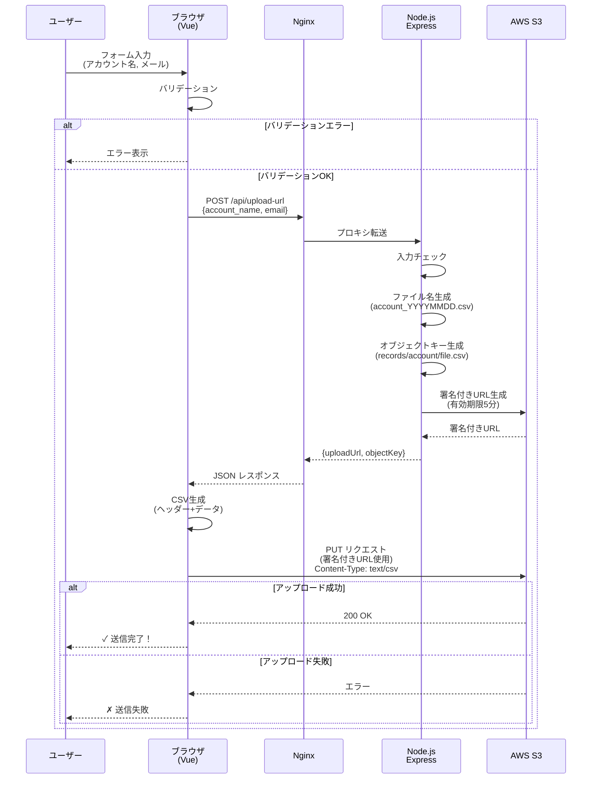

# アカウント登録アプリ - プロジェクト概要

> Vue 3 + Node.js + AWS S3 を使ったシンプルなアカウント登録アプリケーション

**公開URL**: https://poke-calc.com
**作成日**: 2026年2月
**ステータス**: 本番稼働中 🚀

---

## 📋 目次

1. [プロジェクト概要](#プロジェクト概要)
2. [主な機能](#主な機能)
3. [システムアーキテクチャ](#システムアーキテクチャ)
4. [技術スタック](#技術スタック)
5. [AWS構成](#aws構成)
6. [データフロー](#データフロー)
7. [使い方](#使い方)
8. [開発環境](#開発環境)
9. [今後の展望](#今後の展望)

---

## 🎯 プロジェクト概要

このアプリは、ユーザーがアカウント名とメールアドレスを入力し、その情報を**CSV形式でAWS S3に保存**するシンプルなWebアプリケーションです。

### なぜこのアプリを作ったか

- S3への**署名付きURL**を使った安全なアップロードの実装例として
- Vue 3とNode.jsを組み合わせたモダンなWebアプリの構成例として
- EC2へのデプロイとNginxを使ったリバースプロキシの実践例として

### 主な特徴

✅ **シンプルで使いやすい**UI
✅ **セキュアな**署名付きURLを使ったS3アップロード
✅ **バリデーション**が充実（フロントエンド・バックエンド両方で実施）
✅ **スケーラブル**な構成（EC2 + S3）
✅ **ローカル開発環境**も完備（MinIOを使用）

---

## 🚀 主な機能

### 1. アカウント情報の入力

- **アカウント名**（半角英数字のみ）
- **メールアドレス**（有効な形式）

### 2. リアルタイムバリデーション

- フロントエンドでの入力チェック
- バックエンドでの二重チェック
- エラーメッセージの表示

### 3. CSV形式でのS3保存

- ファイル名: `{アカウント名}_YYYYMMDD.csv`
- 保存先: `records/{アカウント名}/{ファイル名}`
- ヘッダー付きCSV形式

### 4. 結果のフィードバック

- 成功時: 保存先パスを表示
- 失敗時: わかりやすいエラーメッセージ

---

## 🏗️ システムアーキテクチャ

### 全体構成図



### アーキテクチャのポイント

#### 🔹 Nginx（リバースプロキシ）
- 静的ファイル（フロントエンド）を配信
- `/api/`へのリクエストをバックエンド（Node.js）にプロキシ
- HTTPSの終端（SSL証明書管理）

#### 🔹 フロントエンド（Vue 3）
- SPAとして動作
- ユーザー入力のバリデーション
- バックエンドAPIとの通信

#### 🔹 バックエンド（Node.js + Express）
- 署名付きURLの生成
- 入力データのバリデーション
- AWS S3との連携

#### 🔹 AWS S3
- CSVファイルの永続化ストレージ
- CORS設定によりブラウザからの直接アップロードを許可

---

## 🛠️ 技術スタック

### フロントエンド

| 技術 | バージョン | 用途 |
|------|-----------|------|
| **Vue.js** | 3.4.0 | UIフレームワーク |
| **Vite** | 5.0.0 | ビルドツール |
| **Axios** | 1.6.0 | HTTP通信ライブラリ |

### バックエンド

| 技術 | バージョン | 用途 |
|------|-----------|------|
| **Node.js** | 18.x | ランタイム |
| **Express** | 4.18.0 | Webフレームワーク |
| **AWS SDK v3** | 3.490.0 | S3操作 |
| **CORS** | 2.8.5 | CORS設定 |
| **dotenv** | 16.3.0 | 環境変数管理 |

### インフラ

| 技術 | 用途 |
|------|------|
| **AWS EC2** | アプリケーションホスティング |
| **AWS S3** | CSVファイルストレージ |
| **Nginx** | リバースプロキシ・静的ファイル配信 |
| **PM2** | Node.jsプロセス管理 |
| **Let's Encrypt** | SSL証明書（HTTPS） |

### 開発環境

| 技術 | 用途 |
|------|------|
| **Docker** | MinIOコンテナ |
| **MinIO** | ローカルS3互換ストレージ |

---

## ☁️ AWS構成

### デプロイメント図



### AWS リソース一覧

#### EC2インスタンス
- **インスタンスタイプ**: t2.micro（推奨）
- **Elastic IP**: XXX.XXX.XXX.XXX（固定）
- **セキュリティグループ**: HTTP(80), HTTPS(443), SSH(22)開放
- **リージョン**: ap-southeast-2（シドニー）

#### S3バケット
- **バケット名**: `sample-vue-app-prod`
- **リージョン**: ap-southeast-2（シドニー）
- **CORS設定**: `https://poke-calc.com`からのアクセス許可
- **パブリックアクセス**: ブロック（署名付きURLのみ許可）

#### Route 53
- **ホストゾーン**: poke-calc.com
- **Aレコード**: Elastic IPを指定

#### IAM
- **ユーザー**: s3-user
- **権限**: S3バケットへの PutObject, GetObject, ListBucket

---

## 🔄 データフロー

### アップロード処理のシーケンス図



### データフローのポイント

#### 1️⃣ フロントエンドバリデーション
- ユーザー入力を即座にチェック
- 無効なデータはサーバーに送らない

#### 2️⃣ 署名付きURLの生成
- バックエンドがS3への一時的なアップロード権限を発行
- 有効期限は5分間
- セキュアで効率的

#### 3️⃣ 直接S3アップロード
- ブラウザからS3へ直接PUT
- サーバーを経由しないため高速
- サーバーの負荷を軽減

#### 4️⃣ CORS設定
- S3のCORS設定により、ブラウザからのクロスオリジンアクセスを許可
- `https://poke-calc.com` のみ許可

---

## 📱 使い方

### エンドユーザー向け

1. **アクセス**: https://poke-calc.com にアクセス
2. **入力**: アカウント名とメールアドレスを入力
3. **送信**: 「送信」ボタンをクリック
4. **完了**: 成功メッセージが表示されたら完了

### 保存されるデータ

#### CSV形式
```csv
account_name,email,created_at
Alice123,alice@example.com,2026-02-15T10:30:00.000Z
```

#### S3保存先
```
s3://sample-vue-app-prod/records/Alice123/Alice123_20260215.csv
```

---

## 💻 開発環境

### ローカル開発の起動方法

#### 1. MinIO起動（ローカルS3代替）

```bash
# プロジェクトルートで実行
docker-compose up -d

# MinIO Console: http://localhost:9001
# Username: minioadmin
# Password: minioadmin
```

#### 2. バックエンド起動

```bash
cd backend
cp .env.example .env
# .envを編集（MinIO設定）
npm install
npm run dev
```

#### 3. フロントエンド起動

```bash
cd frontend
npm install
npm run dev
# http://localhost:3000
```

### 環境変数の設定

#### 本番環境（AWS S3）
```env
AWS_REGION=ap-southeast-2
AWS_ACCESS_KEY_ID=AKIAxxxxx
AWS_SECRET_ACCESS_KEY=xxxxxxxx
S3_BUCKET_NAME=sample-vue-app-prod
```

#### 開発環境（MinIO）
```env
AWS_REGION=us-east-1
AWS_ACCESS_KEY_ID=minioadmin
AWS_SECRET_ACCESS_KEY=minioadmin
S3_ENDPOINT=http://localhost:9000
S3_BUCKET_NAME=sample-app-dev
```

---

## 🎯 今後の展望

### 短期的な改善案

- [ ] **入力項目の追加**
  - 電話番号、住所などのフィールド追加

- [ ] **CSVダウンロード機能**
  - S3に保存されたCSVを取得・ダウンロード

- [ ] **エラーハンドリングの改善**
  - より詳細なエラーメッセージ
  - リトライ機能

### 中期的な改善案

- [ ] **データベース連携**
  - S3だけでなくRDSにも保存

- [ ] **認証機能の追加**
  - ログイン機能
  - ユーザーごとのデータ管理

- [ ] **管理画面の作成**
  - 登録データの一覧表示
  - 検索・フィルター機能

### 長期的な改善案

- [ ] **マイクロサービス化**
  - 機能ごとにサービスを分離

- [ ] **Kubernetes移行**
  - スケーラビリティの向上

- [ ] **CI/CDパイプライン**
  - GitHub Actionsによる自動デプロイ

---

## 📚 関連ドキュメント

- [デプロイ手順書](./AWS_DEPLOYMENT_GUIDE.md)
- [S3バケットセットアップ](./S3_BUCKET_SETUP.md)
- [アーキテクチャ決定記録](./adr/0001-sample-app-architecture.md)
- [アプリケーション仕様](./specs/app-spec.md)

---

## 🤝 開発チーム

- **フロントエンド**: Vue 3 + Vite
- **バックエンド**: Node.js + Express
- **インフラ**: AWS EC2 + S3

---

## 📝 変更履歴

| 日付 | バージョン | 変更内容 |
|------|-----------|----------|
| 2026-02-15 | 1.0.0 | 本番リリース |
| 2026-02-09 | 0.1.0 | 初回開発完了 |

---

**作成者**: 開発チーム
**最終更新**: 2026年2月15日
